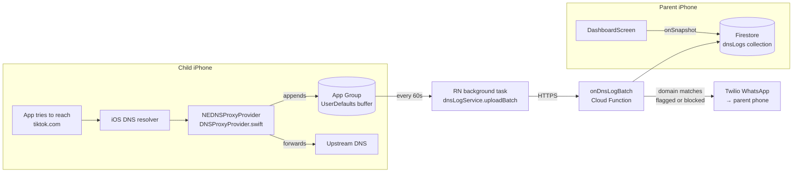

# ChildTracker — Progress Report

_Status as of Sprint 2 (scaffold)._
_Last updated: 2026-04-18._

---

## 1. What we set out to build

**A transparent iOS parental-monitoring app.** The child installs it knowingly,
approves a system DNS profile once, and from then on every domain their phone
resolves gets logged to Firestore and relayed to the parent via WhatsApp.

No silent tracking, no location pings, no activity-button fiction — just DNS.
Everything the child's apps *try to talk to* is visible, because every one of
them starts with a DNS lookup.

---

## 2. What's actually built

### ✅ Sprint 1 — App + backend (done)

| Layer              | Deliverable                                                           |
| ------------------ | --------------------------------------------------------------------- |
| React Native app   | Auth, parent dashboard, child monitor, settings, family linking       |
| State              | Zustand stores (`authStore`, `familyStore`) persisted to AsyncStorage |
| Navigation         | Role-aware stacks (`ParentStack` vs `ChildStack`)                     |
| Styling            | NativeWind (Tailwind for RN)                                          |
| Firestore schema   | `families`, `users`, `dnsLogs` + rules (`dnsLogs` functions-only)     |
| Cloud Function     | `onDnsLogBatch` — flag/block matching + WhatsApp relay                |
| Scheduled Function | `hourlyDigest` — batches matches in digest mode                       |
| WhatsApp           | Twilio client, mocked via console logger under the emulator           |
| Emulator stack     | Firestore 8080 · Auth 9099 · Functions 5001 · UI 4000                 |
| Smoke test         | ✅ `curl → onDnsLogBatch → Firestore → mock-WhatsApp` green           |

### 🚧 Sprint 2 — iOS Network Extension (scaffold in progress)

| Piece                                    | State                                         |
| ---------------------------------------- | --------------------------------------------- |
| `expo prebuild` → `ios/` generated       | ✅ committed (CNG — `ios/` gitignored)        |
| Local Expo config plugin scaffold        | ✅ `plugins/withDnsExtension/`                |
| Entitlements on main app                 | ✅ App Group + `networkextension(dns-proxy)`  |
| Swift source templates                   | ✅ `DNSProxyProvider.swift`, `DomainLogger.swift` |
| Extension `Info.plist` + `.entitlements` | ✅ with `${…}` var substitution               |
| Xcode target wiring                      | 🟡 target + phases + embed OK · dep array WIP |
| Native module bridge (JS ↔ extension)    | ⏳ next                                       |
| Background upload task in RN             | ⏳ next                                       |
| Dev-mode mock DNS source                 | ⏳ next (lets us test without Apple Dev acct) |

### 🔒 Sprint 2.5 — gated on $99 Apple Developer account

Device provisioning, App Group ID registration, on-device DNS interception
test. Cannot be done in the simulator (simulator doesn't route real DNS
through `NEDNSProxyProvider`).

---

## 3. How it works in practice

### End-to-end data flow



### What happens on a DNS query

```
┌──────────────────────────┐
│ child taps TikTok icon   │
└──────────┬───────────────┘
           │ iOS needs to resolve tiktok.com
           ▼
┌──────────────────────────┐
│ NEDNSProxyProvider        │  ← our Swift extension
│  • handleNewFlow(UDP:53)  │
│  • parse QNAME            │
│  • DomainLogger.log()     │──► appends {domain, ts, bundleId}
│  • forward to upstream    │     to App Group UserDefaults
└──────────────────────────┘
```

### The ingest pipeline

```
[RN app drain]  ──POST──►  onDnsLogBatch (Cloud Function)
                              │
                              ├── for each log:
                              │     if domain ∈ blockedDomains → mark BLOCKED
                              │     elif domain ∈ flaggedDomains → mark FLAGGED
                              │     else                         → mark ALLOWED
                              │
                              ├── batch.commit() → dnsLogs collection
                              │
                              └── if match AND alertMode ≠ 'digest':
                                    Twilio client → WhatsApp → parent
```

### Family model

```
families/{familyId}
 ├── parentId
 ├── linkCode           ← child enters this to join
 ├── alertMode          ← 'instant' | 'digest' | 'both'
 ├── flaggedDomains[]   ← notify
 └── blockedDomains[]   ← notify + (later) sinkhole
```

---

## 4. Code map

```
childtracker/
├── app.config.ts                         ← registers withDnsExtension plugin
├── firebase.json                         ← emulator + deploy config
├── firestore.rules                       ← dnsLogs = functions-only write
│
├── functions/
│   └── src/index.ts                      ← onDnsLogBatch + hourlyDigest
│
├── plugins/withDnsExtension/             ← ★ the Expo config plugin
│   ├── app.plugin.js                     ← entitlements + Xcode target wiring
│   ├── package.json
│   └── swift/
│       ├── DNSProxyProvider.swift        ← NEDNSProxyProvider subclass
│       ├── DomainLogger.swift            ← App Group buffer
│       ├── Info.plist                    ← NSExtensionPoint = dns-proxy
│       └── Extension.entitlements        ← App Group + NE entitlement
│
├── src/
│   ├── navigation/                       ← RootNavigator picks stack by role
│   ├── screens/
│   │   ├── WelcomeScreen.tsx
│   │   ├── ParentSetupScreen.tsx
│   │   ├── LinkCodeScreen.tsx
│   │   ├── DashboardScreen.tsx
│   │   ├── SettingsScreen.tsx
│   │   └── MonitorScreen.tsx
│   ├── services/
│   │   ├── firebase.ts
│   │   ├── familyService.ts
│   │   ├── dnsLogService.ts
│   │   └── extensionBridge.ts            ← placeholder, real native module next
│   ├── store/                            ← zustand, persisted
│   └── types/                            ← dns.ts, family.ts, index.ts
│
└── ios/                                  ← generated by `expo prebuild`
                                            (gitignored — CNG model)
```

---

## 5. How to test it today

### 5.1 Prereqs

```bash
node -v    # must be 20.x — use nvm: `nvm use`
```

### 5.2 Install + start the emulator stack

```bash
npm install
npm run emulators
```

Emulator UI → <http://localhost:4000>.

### 5.3 Smoke-test the backend pipeline (no phone needed)

In a second terminal:

```bash
# 1. Create a family in the emulator UI or via the app, note the familyId.
# 2. Fire a fake DNS batch at the function:

curl -X POST \
  http://localhost:5001/<projectId>/us-central1/onDnsLogBatch \
  -H 'Content-Type: application/json' \
  -d '{
    "familyId": "<familyId>",
    "childId":  "<childId>",
    "logs": [
      { "domain": "tiktok.com", "timestamp": '"$(date +%s%3N)"' },
      { "domain": "google.com", "timestamp": '"$(date +%s%3N)"' }
    ]
  }'
```

**Expected:**

- Firestore `dnsLogs` gets two docs — `tiktok.com` marked `flagged`, `google.com` marked `allowed`.
- Functions terminal logs `[mock WhatsApp] → +15551234567: 🚨 ...tiktok.com...`.
- Dashboard shows both entries live (Firestore `onSnapshot`).

### 5.4 Prebuild the native project (once you need Xcode)

```bash
npx expo prebuild --platform ios --clean
open ios/ChildTracker.xcworkspace
```

The config plugin will:

1. Write `ChildTrackerDNS/` into `ios/` with Swift + plists.
2. Add App Group + `networkextension(dns-proxy)` entitlements to the main app.
3. Create the `ChildTrackerDNS` extension target in `ChildTracker.xcodeproj`.
4. Attach an **Embed App Extensions** phase on the main target.

### 5.5 What you cannot test yet

- **Real DNS interception** — needs an Apple Developer account + real device.
  The iOS simulator does **not** route DNS through `NEDNSProxyProvider`.
- **Installing the DNS profile** — `NEDNSSettingsManager` requires a provisioned build.
- **End-to-end child→parent on a real phone** — gated on the above.

Those three are Sprint 2.5 once the $99 account is in place. Everything upstream
of the extension (Firestore rules, Cloud Function matching, WhatsApp relay,
dashboard snapshotting, family linking) already works against the emulator.

---

## 6. Key decisions worth remembering

| Decision                                              | Why                                                               |
| ----------------------------------------------------- | ----------------------------------------------------------------- |
| DNS-only, no location / activity buttons              | Transparent, low-battery, kid can't fake it                       |
| Expo managed → Continuous Native Generation           | Keeps `ios/` out of git; regenerated from `app.config.ts` + plugin |
| Config plugin in JS (not TS)                          | Expo loads `app.plugin.js`; avoids extra build step               |
| Timestamp stored as `Date`, not `Timestamp.fromMillis` | Admin SDK auto-converts; sidesteps emulator module-loading quirk  |
| WhatsApp mocked under `FUNCTIONS_EMULATOR=true`       | Develop the whole pipeline without a Twilio account               |
| Dev-mode mock DNS source (planned)                    | Exercise the upload + dashboard path before Apple account arrives |

---

## 7. What's next

1. Finish pbxproj wiring (main-target → extension `dependencies` edge).
2. Native module bridge so RN can read the App Group buffer.
3. Background task to drain the buffer every 60s and POST to Firestore.
4. VPN install screen on the child flow (`NEDNSSettingsManager` entitlement prompt).
5. Dev-mode mock DNS source in `MonitorScreen` — lets us stress the whole pipeline without a real device.

See [SPRINT.md](SPRINT.md) for the live task list and [ROADMAP.md](ROADMAP.md) for the phase plan.
